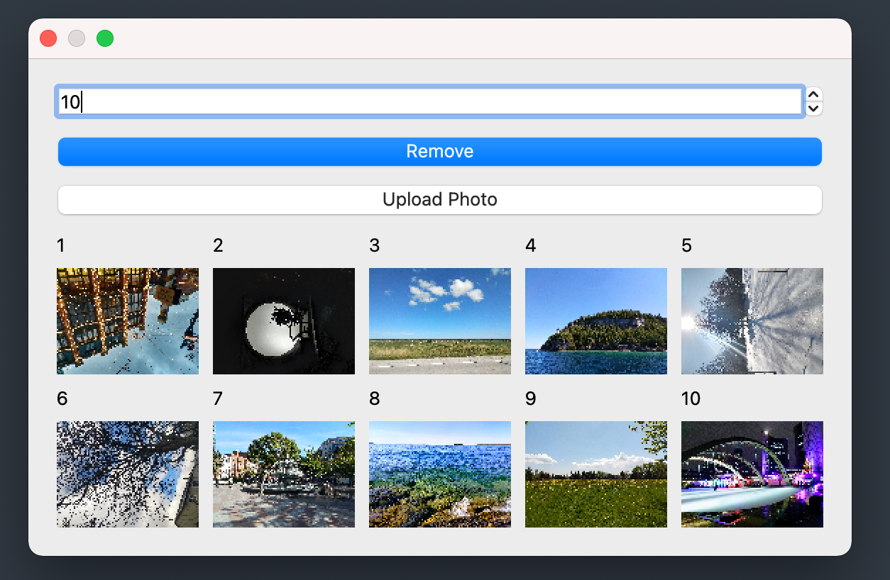
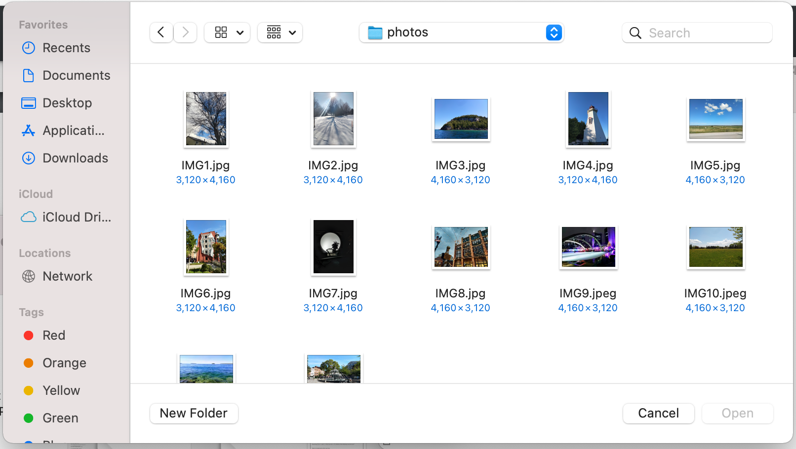
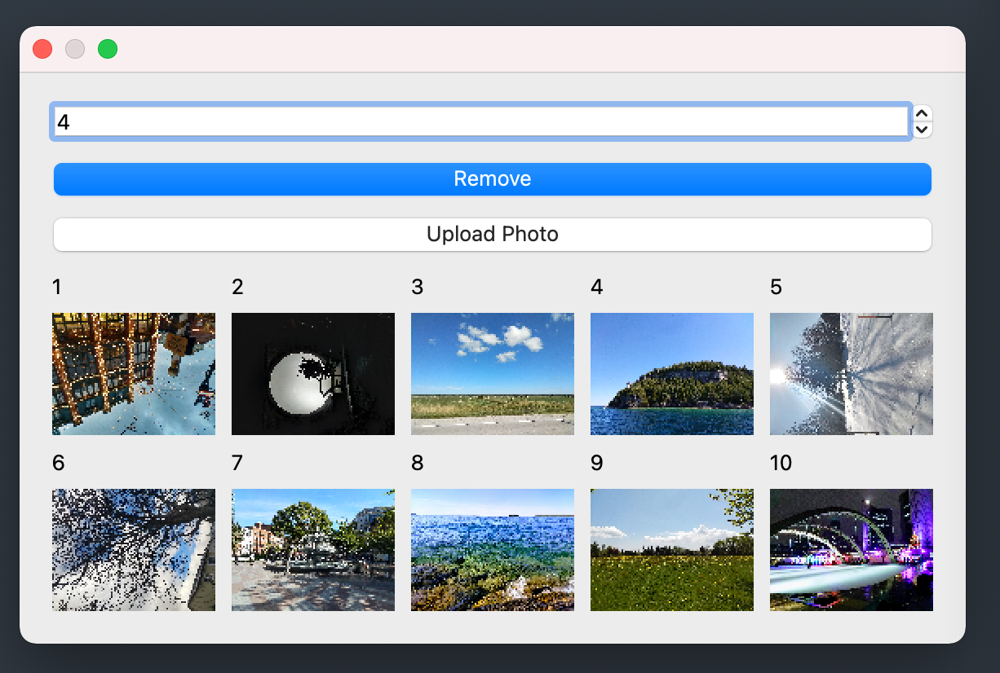
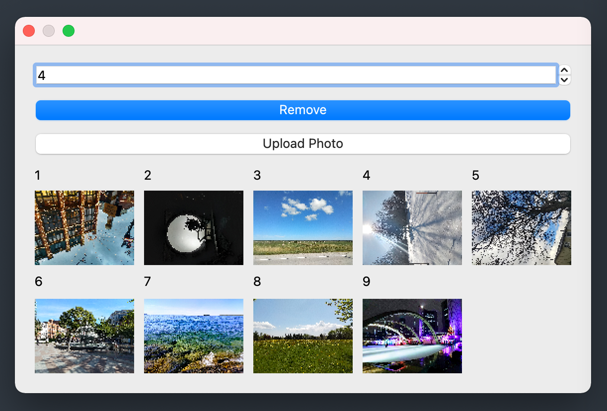

# Qt Photo App

This is an app that allows users to upload photos and display and store the photos in a file until the user deletes them.

## Setup

```
python3 -m venv env
source env/bin/activate
pip install pyside6
python3 src/photo-app.py
```



## Uploading Pictures

Click the upload button to open the file explorer and select a photo to upload.




## Deleting Pictures

Select the index of the picture you would like to delete and then click the delete button.



